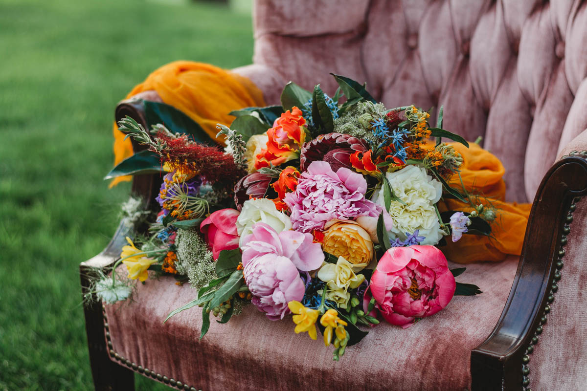
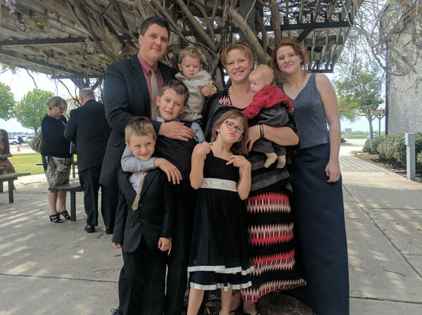

	

	

    

    

    	

		<h2 class="heading card-title">What We Do</h2>
		
Thank you so much for taking the time to look at our website. We love what we do here at Rosetree, our passion for flowers is what has driven our business for over 25 years! The flowers we carry are always changing because making unique, personalized arrangements that suprise and wow our customers is what we love.

		

	

	

	

	

    

    

    	

		<h2 class="heading card-title">Locations</h2>
		
Rosetree has changed locations over the years quite a few times. From China Spring to downtown Waco, we were even in the Magnolia Silos Bakery before it was the Magnolia Silos. We currently have a warehouse in China Spring where we make all our floral arrangements. We also have a pickup location at Spice Village at their front desk. Spice Village is a wonderful shopping center with a large group of independently owned shops. Each space has its own unique items and is a great place to buy a give. Be sure to check them out [at their website](https://spicewaco.com/) or have a look around when you go by.

		

	

	

	

	

    

    

    	

		<h2 class="heading card-title">The Jones Family</h2>
		
In 2012, our family bought Rosetree and started our journey as full time florists. Having a love for gardening, the outdoors and anything beautiful gave us a good foundation. The biggest asset was our previous experience in the floral industry, event setup and design and our customer service skills. We have six wonderful kids ranging from 14 to 1. They love to help and are pretty creative so some of the work you see may have some of their handiwork . No matter what your needs though you will always get something unique and creative at Rosetree.

		

	

	

